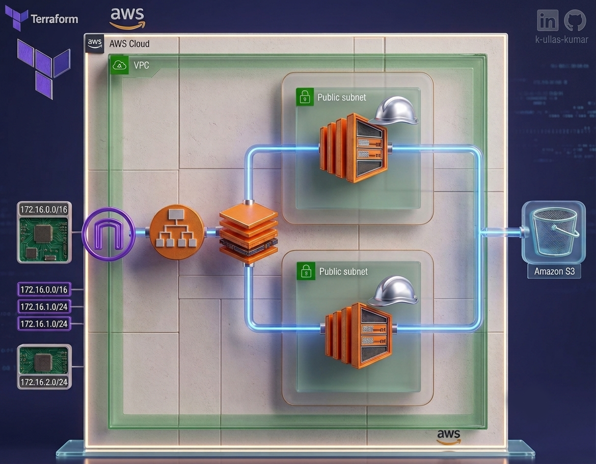

# 🚀 AWS Infrastructure Automation using Terraform

> **Welcome to the most efficient way to manage your AWS infrastructure! This project automates the provisioning of a complete, scalable AWS environment using Terraform, reducing manual effort by 70% and ensuring consistent, reliable deployments.**

This project demonstrates how to automate AWS infrastructure using **Terraform Infrastructure as Code (IaC)** instead of creating every resource manually through the AWS Console.

It is designed to be **beginner-friendly** and is a great hands-on project for learning **AWS + Terraform + DevOps fundamentals**.

---

## 🏗️ Architecture

The project creates a basic AWS web infrastructure consisting of:



<!-- 
```text

                         🌐 Internet
                              │
                              ▼
                    ┌──────────────────┐
                    │ Application      │
                    │ Load Balancer    │
                    │      (ALB)       │
                    └────────┬─────────┘
                             │
                    ┌────────┴─────────┐
                    │                  │
                    ▼                  ▼
             ┌─────────────┐    ┌─────────────┐
             │   EC2 #1    │    │   EC2 #2    │
             │ Web Server  │    │ Web Server  │
             └─────────────┘    └─────────────┘
                    │                  │
                    └────────┬─────────┘
                             │
                    ┌─────────────────┐
                    │      VPC        │
                    │   10.0.0.0/16   │
                    └─────────────────┘
                             │
                  ┌──────────┴──────────┐
                  │                     │
           ┌─────────────┐       ┌─────────────┐
           │  Subnet #1  │       │  Subnet #2  │
           │  10.0.0.0/24│       │ 10.0.1.0/24 │
           └─────────────┘       └─────────────┘
                  │                     │
                  └──────────┬──────────┘
                             │
                    ┌─────────────────┐
                    │ Internet Gateway│
                    └─────────────────┘
```
-->
---

## ✨ What You Will Learn

By completing this project, you will get practical experience with:

* ☁️ AWS
* 🏗️ Terraform
* 📦 Infrastructure as Code
* 🌐 VPC
* 🔗 Subnets
* 🌍 Internet Gateway
* 🛣️ Route Tables
* 🔐 Security Groups
* 💻 EC2
* ⚖️ Application Load Balancer
* 🎯 Target Groups
* 👂 ALB Listeners
* 📤 Terraform Outputs
* 🔄 Terraform lifecycle
* 🧹 Terraform Destroy

---

## 📁 Project Structure

```text
.
├── README.md
├── aws_infrastructure_architecture.png
├── main.tf
├── provider.tf
├── userdata.sh
├── userdata1.sh
└── variables.tf
```

### 📄 File Explanation

| File                                  | Purpose                                            |
| ------------------------------------- | -------------------------------------------------- |
| `provider.tf`                         | Configures Terraform and the AWS provider          |
| `main.tf`                             | Defines the AWS infrastructure resources           |
| `variables.tf`                        | Stores configurable Terraform variables            |
| `userdata.sh`                         | User-data script used to configure an EC2 instance |
| `userdata1.sh`                        | User-data script for the second EC2 instance       |
| `aws_infrastructure_architecture.png` | Architecture diagram of the project                |

---

# ⚙️ Prerequisites

Before starting, make sure you have:

### 1. AWS Account

You need an AWS account with sufficient permissions to create the required resources.

### 2. AWS CLI

Install and configure the AWS CLI.

Check installation:

```bash
aws --version
```

Configure your AWS credentials:

```bash
aws configure
```

You will be asked for:

```text
AWS Access Key ID
AWS Secret Access Key
Default region name
Default output format
```

> 🔐 **Never upload your AWS access keys, secret keys, passwords, or other credentials to GitHub.**

The recommended approach is to authenticate through the AWS CLI/environment rather than hard-coding credentials inside Terraform configuration.

---

### 3. Terraform

Check whether Terraform is installed:

```bash
terraform --version
```

If Terraform is not installed, install it from the official HashiCorp Terraform website.

---

# 🚀 Getting Started

## Step 1 — Clone the Repository

```bash
git clone <https://github.com/k-ullas-kumar/AWS-Infrastructure-Automation-using-Terraform.git>
```

Move into the project:

```bash
cd <AWS-Infrastructure-Automation-using-Terraform>
```

---

## Step 2 — Configure AWS

Make sure your AWS CLI is configured:

```bash
aws configure
```

You can verify your AWS identity with:

```bash
aws sts get-caller-identity
```

If the command returns your AWS account information, authentication is working.

---

# 🧩 Step 3 — Initialize Terraform

Run:

```bash
terraform init
```

This downloads the required Terraform provider and initializes the working directory.

You should see a successful initialization message.

---

# 🔍 Step 4 — Validate the Configuration

Run:

```bash
terraform validate
```

Terraform will check whether the configuration is syntactically and structurally valid.

Expected result:

```text
Success! The configuration is valid.
```

---

# 🧹 Step 5 — Format the Code

Run:

```bash
terraform fmt
```

This automatically formats the Terraform files according to Terraform's standard formatting.

---

# 📋 Step 6 — Review the Infrastructure Plan

Before creating anything, run:

```bash
terraform plan
```

This shows you what Terraform intends to create, modify, or destroy.

### 💡 Always review the plan before applying it.

---

# 🚀 Step 7 — Create the Infrastructure

Run:

```bash
terraform apply
```

Terraform will ask for confirmation.

Type:

```text
yes
```

Terraform will then begin creating the AWS infrastructure.

Depending on AWS and your network connection, resource creation may take some time.

> ⏳ Be patient while the EC2 instances, target group, load balancer, and other AWS resources become ready.

---

# 🌐 Step 8 — Access the Application

After Terraform finishes, the project can expose the **Application Load Balancer DNS name** through Terraform output.

You can also find the ALB DNS name through:

```text
AWS Console
      ↓
EC2
      ↓
Load Balancers
      ↓
Application Load Balancer
```

Open the ALB DNS name in your browser.

The request should be forwarded to one of the EC2 web servers.

---

# ⚖️ How the Load Balancer Works

The Application Load Balancer receives HTTP requests from users.

```text
             User
              │
              ▼
       Application ALB
              │
       ┌──────┴──────┐
       │             │
       ▼             ▼
    EC2 #1         EC2 #2
```

The EC2 instances are registered with the **Target Group**.

The ALB uses a **Listener** to receive HTTP traffic and forward requests to the Target Group.

The Target Group performs health checks to determine whether the EC2 targets are healthy.

```text
Internet
   │
   ▼
ALB :80
   │
   ▼
Listener
   │
   ▼
Target Group
   │
   ├── EC2 #1
   │
   └── EC2 #2
```

---

# ❤️ Health Checks

The Target Group uses a health check to verify that the web servers are responding correctly.

The project uses the root path:

```text
/
```

If an instance is unhealthy, the load balancer should not send normal traffic to that unhealthy target.

> ⏳ It may take some time for the targets to become healthy after the infrastructure is created.

---

# 🌐 Networking Overview

The project creates a custom VPC.

Example CIDR:

```text
10.0.0.0/16
```

Within the VPC, separate subnets are created.

Example:

```text
VPC
10.0.0.0/16
│
├── Subnet 1
│   └── 10.0.0.0/24
│
└── Subnet 2
    └── 10.0.1.0/24
```

The subnets are connected to an Internet Gateway through the route table configuration.

---

# 🔐 Security Group

The project uses a Security Group to control network traffic to the infrastructure.

HTTP traffic is allowed on:

```text
Port 80
```

The project is intended as a learning/demo environment, so review and tighten security rules before using a similar configuration in production.

---

# 📤 Terraform Outputs

Terraform outputs are useful when you want Terraform to display important information after deployment.

For example:

```text
Load Balancer DNS Name
```

Instead of manually searching for the ALB inside the AWS Console, Terraform can print the value after deployment.

You can also view outputs using:

```bash
terraform output
```

---

# 🧹 Destroy Everything

⚠️ **IMPORTANT**

AWS resources can incur charges.

When you finish experimenting with the project, destroy the infrastructure.

First, you can check what Terraform plans to destroy:

```bash
terraform plan -destroy
```

Then destroy the resources:

```bash
terraform destroy
```

Confirm with:

```text
yes
```

Terraform will remove the resources defined by the project.

### 💰 Avoid unexpected AWS charges

Do not leave resources such as load balancers and EC2 instances running unnecessarily.

---

# 🚨 IMPORTANT: Do NOT Commit Terraform State

**Never push Terraform state files to GitHub.**

Do NOT commit:

```text
terraform.tfstate
terraform.tfstate.backup
```

Terraform state can contain sensitive infrastructure information.

A `.gitignore` file is strongly recommended:

```gitignore
# Terraform
.terraform/
*.tfstate
*.tfstate.*
crash.log
crash.*.log

# Terraform variable files
*.tfvars
*.tfvars.json

# Secrets
.env
.env.*
```

> 🔐 Never commit AWS credentials, secret keys, passwords, or other sensitive information.

---

# 🧠 Recommended Terraform Workflow

A simple Terraform workflow is:

```text
┌───────────────┐
│ Write Code    │
└───────┬───────┘
        │
        ▼
┌───────────────┐
│ terraform init│
└───────┬───────┘
        │
        ▼
┌───────────────────┐
│ terraform validate│
└────────┬──────────┘
         │
         ▼
┌────────────────┐
│ terraform fmt  │
└───────┬────────┘
        │
        ▼
┌────────────────┐
│ terraform plan │
└───────┬────────┘
        │
        ▼
┌────────────────┐
│ terraform apply│
└───────┬────────┘
        │
        ▼
    AWS Resources
        │
        ▼
┌─────────────────┐
│ terraform       │
│ destroy         │
└─────────────────┘
```

---

# 🛠️ Useful Commands

### Initialize

```bash
terraform init
```

### Validate

```bash
terraform validate
```

### Format

```bash
terraform fmt
```

### Preview changes

```bash
terraform plan
```

### Create infrastructure

```bash
terraform apply
```

### View outputs

```bash
terraform output
```

### Preview destruction

```bash
terraform plan -destroy
```

### Delete infrastructure

```bash
terraform destroy
```

---

# 📚 Beginner Tips

If you are completely new to Terraform, don't just copy and run the code.

Try to understand the AWS Console equivalent of every Terraform resource.

For example:

```text
AWS Console                Terraform
────────────────────────────────────────
VPC                  →     aws_vpc
Subnet               →     aws_subnet
Internet Gateway     →     aws_internet_gateway
Route Table          →     aws_route_table
Security Group       →     aws_security_group
EC2                  →     aws_instance
Load Balancer        →     aws_lb
Target Group         →     aws_lb_target_group
Listener             →     aws_lb_listener
```

Understanding the AWS resource first makes Terraform much easier to understand.

---

# 🎯 Learning Path

A good way to learn this project is:

```text
AWS Basics
    ↓
VPC
    ↓
Subnets
    ↓
Internet Gateway
    ↓
Route Tables
    ↓
Security Groups
    ↓
EC2
    ↓
User Data
    ↓
Load Balancer
    ↓
Target Group
    ↓
Listener
    ↓
Terraform
    ↓
Infrastructure as Code
```

---

# 💼 Why This Project Is Useful

This project represents a simplified version of tasks that DevOps engineers commonly perform:

* Automating infrastructure
* Creating repeatable environments
* Provisioning cloud resources
* Configuring networking
* Deploying web servers
* Using load balancing
* Managing infrastructure through code
* Destroying and recreating environments consistently

Instead of manually creating infrastructure through the AWS Console, Terraform allows the infrastructure to be described as code and recreated when needed.

---

# ⚠️ Production Considerations

This repository is primarily for **learning project**.

---

# 🧪 Experiment & Learn

Don't be afraid of Terraform errors.

A useful learning cycle is:

```text
Make a change
     ↓
terraform validate
     ↓
terraform plan
     ↓
Understand the error
     ↓
Check Terraform/AWS documentation
     ↓
Fix the configuration
     ↓
terraform apply
```

Errors are part of learning Infrastructure as Code.

---

# 📌 Important Reminder

Before using the project:

✅ Configure AWS credentials correctly
✅ Install Terraform
✅ Understand what resources will be created
✅ Run `terraform plan` before `terraform apply`
✅ Never commit secrets
✅ Never commit Terraform state files
✅ Destroy AWS resources when finished

---

# ⭐ Project Goal

The goal of this project is not simply to run Terraform commands.

The goal is to understand **how AWS infrastructure works and how Terraform can automate it**.

> **Learn the infrastructure first. Automate it second.**

---

## 🤝 Contributing

If you find an improvement, bug, or have a better approach, feel free to open an issue or submit a pull request.

---

## ⭐ Support

If this project helped you understand AWS or Terraform, consider giving the repository a ⭐.

Happy Learning! 🚀

**AWS + Terraform + DevOps = Infrastructure as Code**
